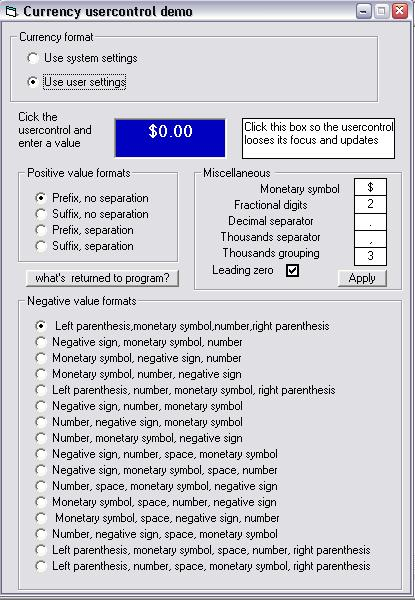



## Currency usercontrol

### Description

This usercontrol uses by default the system's Regional settings, but you can change these values to suit your needs. This usercontrol comes with a nice demo program allowing you to experiment. Extensively documented. In my view a must for those interested in local settings but who never investigated the issue or got discouraged by the documentation ;)

Inspired by PSC submission: Euro / Dollar input box without the use of Maskedit by Coder86 (ID 61011). Zip 11KB. (Paul Turcksin)
 
### More Info
 

             |
---                |---
**Submitted On**   |2005-06-20 05:30:06
**By**             |[Paul Turcksin](https://github.com/Planet-Source-Code/PSCIndex/blob/master/ByAuthor/paul-turcksin.md)
**Level**          |Beginner
**User Rating**    |5.0 (15 globes from 3 users)
**Compatibility**  |VB 6\.0
**Category**       |[OLE/ COM/ DCOM/ Active\-X](https://github.com/Planet-Source-Code/PSCIndex/blob/master/ByCategory/ole-com-dcom-active-x__1-29.md)
**World**          |[Visual Basic](https://github.com/Planet-Source-Code/PSCIndex/blob/master/ByWorld/visual-basic.md)
**Archive File**   |[Currency\_u1903796202005\.zip](https://github.com/Planet-Source-Code/paul-turcksin-currency-usercontrol__1-61255/archive/master.zip)

